# 📊 Placement Outlook - Streamlit Learning Project

**Ek comprehensive Streamlit app jo ML models ko deploy karta hai student placement prediction ke liye — saath hi Streamlit ke 10+ core widgets ka hands-on demo bhi.**

---

## 📁 Project Overview

```
Streamlit App/
│
├── Streamlit.py                    # 🚀 Starter app
├── 01_display_basics.py           # 📝 Text display widgets
├── 02_text_input.py               # ⌨️ Text input widget
├── 03_number_input.py             # 🔢 Number input widget
├── 04_selectbox.py                # 📋 Dropdown selection
├── 05_radio_and_checkbox.py       # ⭕ Radio + ☑️ Checkbox
├── 06_slider.py                   # 🎚️ Slider widget
├── 07_button_and_rerun.py         # 🔘 Button + rerun demo
├── 08_feedback_messages.py        # ✅ Colored feedback boxes
├── 09_metric_and_charts.py        # 📈 Metrics + Charts
├── 10_layout_columns_and_sidebar.py # 🧱 Layout (Columns + Sidebar)
├── original_form.py               # 🎯 Main Placement Prediction App
│
├── load_and_save_model.py         # 🤖 Train placement classifier
├── load_and_save_regressor.py     # 🤖 Train package regressor
├── load_and_confirm.py            # ✅ Verify saved models
│
├── student_placement_history.csv  # Placement classification data
├── student_package_prediction.csv # Package regression data
│
├── placement_model.pkl            # Saved classifier
├── package_model.pkl              # Saved regressor
├── placement_columns.pkl          # Column names for classifier
├── package_columns.pkl            # Column names for regressor
│
└── requirements.txt               # Dependencies
```

---

## 1️⃣ Streamlit.py — Starter App

```python
st.title("Placement Outlook")     # Page ka title set karta hai
name = st.text_input("Student_name")  # User se text input leta hai
if st.button("Say hello"):
    st.write(f"hello : {name}")   # Dynamic output
```

### Flow

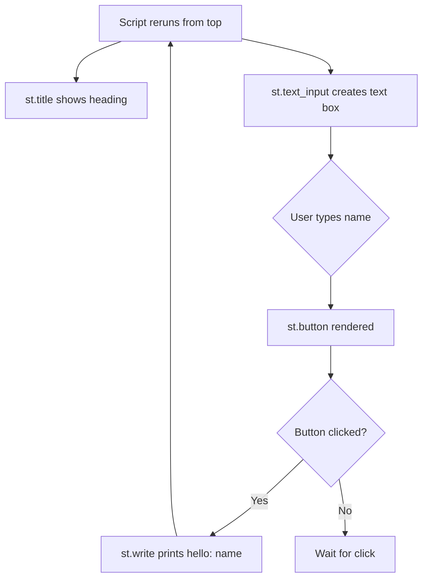

---

## 2️⃣ 01_display_basics.py — Display Family

| Function | Kaam kya hai? | Kyu use karte hain? |
|---|---|---|
| `st.title()` | Sabse bada heading text | Page ka title, ek baar use karo |
| `st.header()` | Major section heading | Content divide karne ke liye |
| `st.subheader()` | Chhota section heading | Sub-sections banane ke liye |
| `st.write()` | All-purpose display | Text, number, DataFrame, chart sab display karta hai |
| `st.caption()` | Chhota grey text | Footnote ya hint ke liye |
| `st.markdown()` | Markdown text display | **Bold**, *italic*, lists, links ke liye |

### Related Functions
- `st.latex` — Math equations
- `st.code` — Code blocks with syntax highlighting
- `st.json` — Pretty-print JSON

### Flow

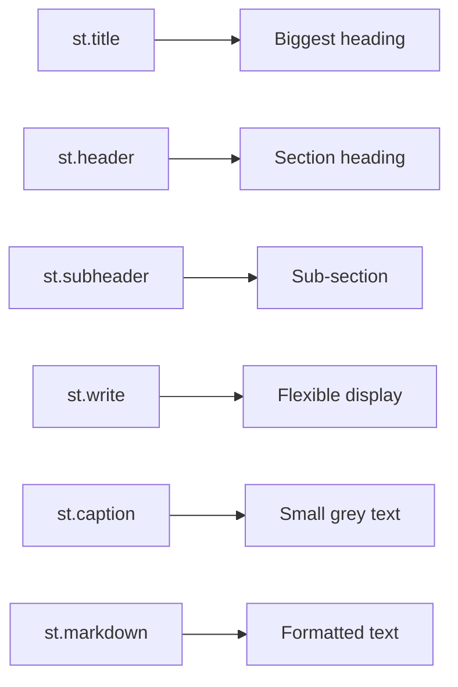

---

## 3️⃣ 02_text_input.py — Text Input

```python
name = st.text_input("What's your name?")
st.write("You typed:", name)
```

| Function | Kaam | Kyu? |
|---|---|---|
| `st.text_input(label)` | Text field create karta hai | User se short text lene ke liye |
| `value=` parameter | Default value set karta hai | Box pre-fill karne ke liye |

### Related Widgets
- `st.text_area` — Multi-line text input
- `st.text_input(..., type="password")` — Password field

### Flow

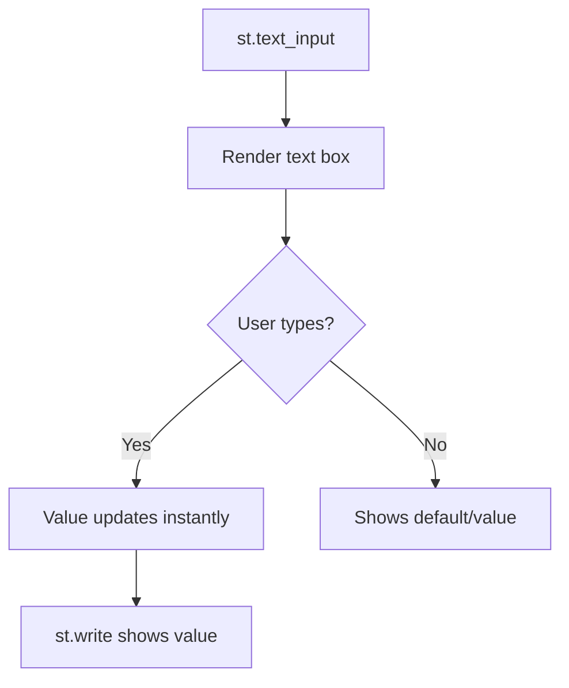

---

## 4️⃣ 03_number_input.py — Number Input

```python
backlogs = st.number_input("Backlogs", min_value=0, max_value=10, step=1)
cgpa = st.number_input("CGPA", min_value=0.0, max_value=10.0, step=0.1)
```

| Function | Kaam | Kyu? |
|---|---|---|
| `st.number_input()` | Number input box | Numbers lene ke liye (int/float) |
| `min_value` | Minimum limit | Range control |
| `max_value` | Maximum limit | Range control |
| `step` | Increment step | Step size define |

### Related Widgets
- `st.slider` — Visual number picking
- `st.number_input(..., format="%.2f")` — Decimal format

### Flow

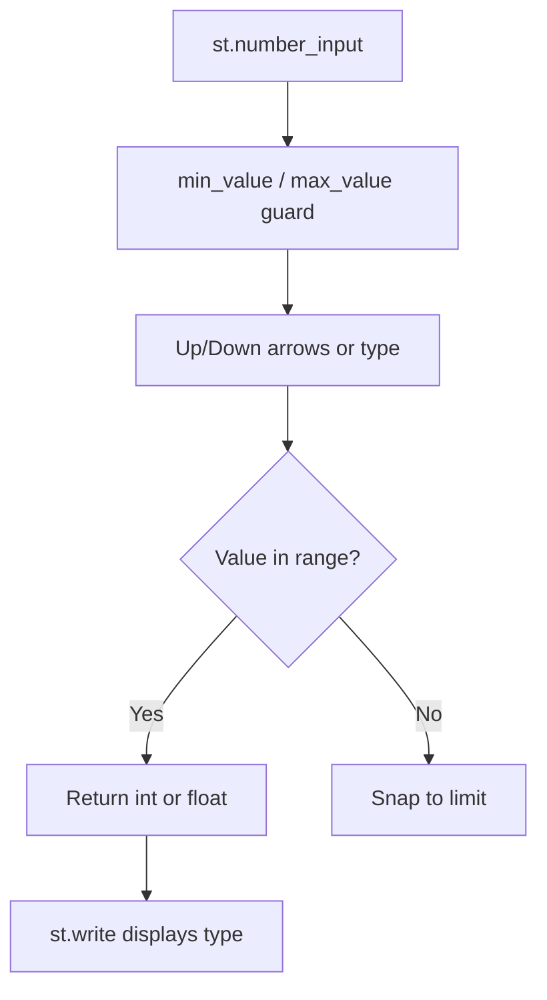

---

## 5️⃣ 04_selectbox.py — Dropdown Selection

```python
specialization = st.selectbox("Specialization", 
    ["Data Science", "Cybersecurity", "Cloud Computing", 
     "Web Development", "Networking"])
```

| Function | Kaam | Kyu? |
|---|---|---|
| `st.selectbox(label, options)` | Dropdown menu | Ek option choose karne ke liye |
| `index=` parameter | Default selection | Kis index pe default select ho |

### Related Widgets
- `st.multiselect` — Multiple items select
- `st.radio` — All options visible at once

### Flow

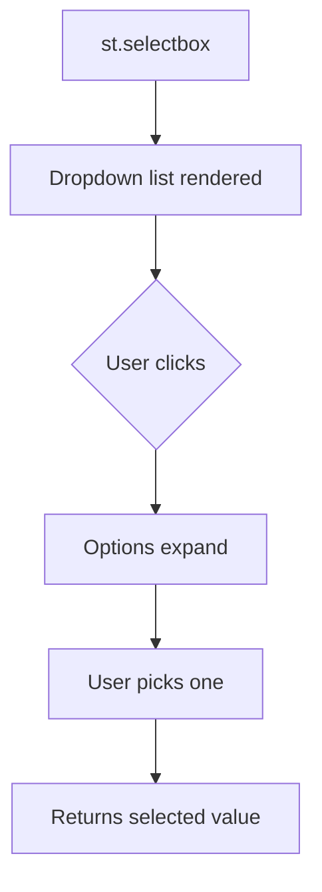

---

## 6️⃣ 05_radio_and_checkbox.py — Radio & Checkbox

```python
internship = st.radio("Internship done?", ["Yes", "No"])
show_details = st.checkbox("Show extra details")
if show_details:
    st.write("Here are the extra details...")
```

| Function | Kaam | Kyu? |
|---|---|---|
| `st.radio(label, options)` | Radio buttons | Saare options ek saath dikhata hai |
| `st.checkbox(label)` | Checkbox tareeka | True/False toggle ke liye |

### Related Widgets
- `st.selectbox` — Same job as radio but dropdown
- `st.toggle` — Switch-style toggle

### Flow

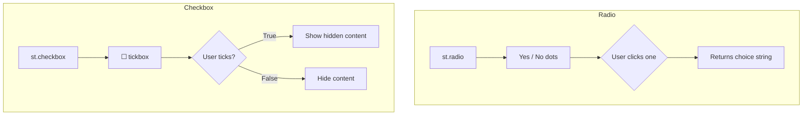

---

## 7️⃣ 06_slider.py — Slider

```python
comm_score = st.slider("Communication score", 0.0, 10.0, 5.0, 0.5)
backlogs_range = st.slider("Backlogs between", 0, 10, (0, 3))  # Range slider
```

| Function | Kaam | Kyu? |
|---|---|---|
| `st.slider(label, min, max, value)` | Draggable slider | Intuitive number selection |
| `value=(a, b)` — tuple | Range slider | Do handles — range select |

### Related Widgets
- `st.number_input` — Same job, typed digits
- `st.select_slider` — Discrete options slider

### Flow

```mermaid
flowchart TD
    A[st.slider] --> B{Single value or range?}
    B -->|Single| C[One handle]
    B -->|Tuple| D[Two handles]
    C --> E[Drag to change number]
    D --> F[Drag ends to set range]
    E --> G[Returns float/int]
    F --> H[Returns tuple (low, high)]
```

---

## 8️⃣ 07_button_and_rerun.py — Button & Rerun

```python
import random
st.write("Random number:", random.randint(1, 1000))
if st.button("Click me"):
    st.write("You clicked the button.")
```

| Function | Kaam | Kyu? |
|---|---|---|
| `st.button(label)` | Clickable button | Action trigger karne ke liye |
| **Rerun behavior** | Har click pe script top se chalti hai | **Streamlit ka heart** — yeh samajhna sabse zaroori hai |

### Key Insight: Rerun Behavior
> Jab bhi user koi widget interact karta hai, poori script top se rerun hoti hai. Isliye random number har click pe change hota hai — even though button ka usse koi lena-dena nahi.

### Related Widgets
- `st.form_submit_button` — Form ke saath button
- `st.download_button` — File download button

### Flow

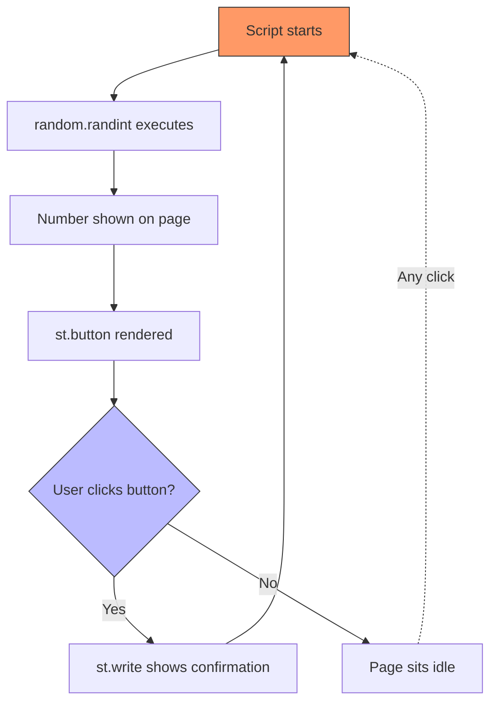

---

## 9️⃣ 08_feedback_messages.py — Feedback Family

```python
st.success("Placed — green means success")
st.error("Not Placed — red means attention")
st.warning("Borderline case — yellow means caution")
st.info("Planning tool — blue means info")
```

| Function | Color | Kyu? |
|---|---|---|
| `st.success()` | 🟢 Green | Positive result batane ke liye |
| `st.error()` | 🔴 Red | Negative result batane ke liye (code error nahi) |
| `st.warning()` | 🟡 Yellow/Amber | Caution ya borderline case |
| `st.info()` | 🔵 Blue | Neutral information |

### Related Functions
- `st.exception` — Actual Python exception display
- `st.toast` — Temporary notification

### Flow

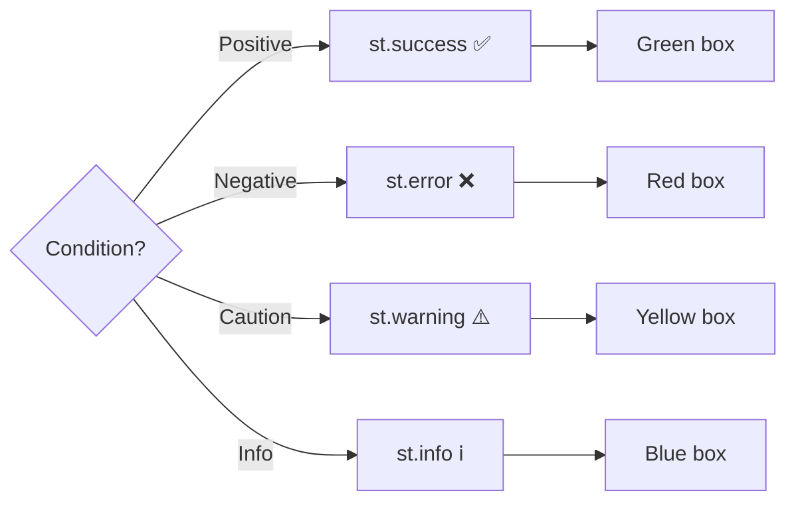

---

## 🔟 09_metric_and_charts.py — Metrics & Charts

```python
st.metric("Estimated Package (LPA)", 6.59, delta=0.6)
st.metric("Backlogs", 0, delta=-1, delta_color="inverse")

chart_data = pd.DataFrame({"Package (LPA)": [6.59, 5.99]}, 
                          index=["This student", "Dataset average"])
st.bar_chart(chart_data)

trend = pd.DataFrame({"AvgPackageLPA": [4.5, 4.9, 5.5, 6.5, 6.7]})
st.line_chart(trend)
```

| Function | Kaam | Kyu? |
|---|---|---|
| `st.metric(label, value, delta)` | Bada bold number + delta arrow | KPI highlight karne ke liye |
| `delta_color="inverse"` | Colors flip | Jab decrease achha ho (backlogs) |
| `st.bar_chart(data)` | Bar chart | Categories compare karta hai |
| `st.line_chart(data)` | Line chart | Trend dikhata hai |

### Related Functions
- `st.area_chart` — Area chart
- `st.scatter_chart` — Scatter plot
- `st.pyplot` — Matplotlib charts
- `st.plotly_chart` — Plotly charts

### Flow

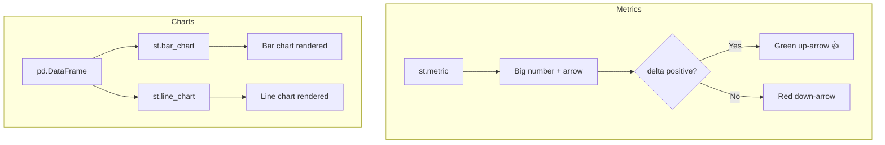

---

## 1️⃣1️⃣ 10_layout_columns_and_sidebar.py — Layout

```python
left, right = st.columns(2)
with left:
    st.metric("Placed Students", 381)
with right:
    st.metric("Not Placed", 219)

st.sidebar.title("Filters")
spec_filter = st.sidebar.selectbox("Specialization", ["All", "Data Science", "Networking"])
```

| Function | Kaam | Kyu? |
|---|---|---|
| `st.columns(n)` | Page ko n columns mein divide karta hai | Side-by-side layout |
| `with left:` context manager | Content ko column mein daalta hai | Organized layout |
| `st.sidebar` | Side panel | Filters/settings ke liye |

### Related Functions
- `st.tabs` — Tabbed layout
- `st.expander` — Collapsible section
- `st.container` — Generic container
- `st.empty` — Placeholder

### Flow

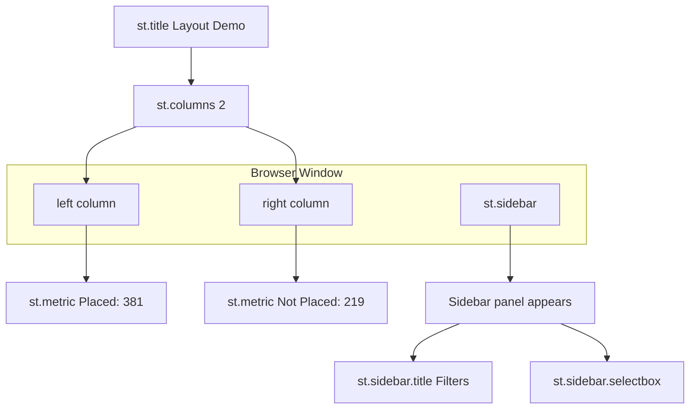

---

## 1️⃣2️⃣ original_form.py — Main Placement Prediction App

**Yeh hai aapki final app — jahan saare widgets milkar ek real ML prediction form banate hain.**

```python
clf = joblib.load("placement_model.pkl")       # Saved classifier load
reg = joblib.load("package_model.pkl")          # Saved regressor load
clf_columns = joblib.load("placement_columns.pkl")  # Column names load
reg_columns = joblib.load("package_columns.pkl")

specialization = st.selectbox("Specialization", [...])  # Dropdown
attendance = st.selectbox("Attendance", ["High","Medium","Low"])
internship = st.selectbox("Internship done?", ["Yes","No"])
backlogs = st.number_input("Backlogs", 0, 10, 1)        # Number
cgpa = st.number_input("CGPA", 0.0, 10.0, 0.1)
comm = st.number_input("Communication score", 0.0, 10.0)

if st.button("Predict"):                                 # Action trigger
    row = pd.DataFrame([{...}])                          # Input row
    row_encoded = pd.get_dummies(row)                   # One-hot encode

    placed = clf.predict(row_encoded.reindex(           # Classify
        columns=clf_columns, fill_value=False))[0]
    package = reg.predict(row_encoded.reindex(           # Regress
        columns=reg_columns, fill_value=False))[0]

    st.write("Will Placed" if placed == 1 else "Will Not Placed")
    st.write("predicted package:", round(package, 2))
```

| Function/Concept | Kaam | Kyu? |
|---|---|---|
| `joblib.load()` | Saved model file load karta hai | Trained model ko wapas use karne ke liye |
| `st.selectbox()` | Dropdown menu | Categorical input lene ke liye |
| `st.number_input()` | Number input box | Numerical input lene ke liye |
| `st.button("Predict")` | Click button | Tab hi prediction trigger hota hai |
| `pd.DataFrame()` | Input data ka table banata hai | Model ko ek row feed karne ke liye |
| `pd.get_dummies()` | Categorical → numeric | ML model sirf numbers samajhta hai |
| `.reindex(columns=..., fill_value=False)` | Missing columns ko 0 se fill karta hai | Training aur inference ke columns match karne ke liye |
| `clf.predict()` | Placement predict (0/1) | Student placed hoga ya nahi |
| `reg.predict()` | Package predict (continuous) | Kitni salary milegi |
| `round(package, 2)` | Decimal round off | Output readable banane ke liye |

### Key Concept: `reindex` + `fill_value=False`
> Jab aap ek single student row ko one-hot encode karte ho, toh kuch columns missing ho sakte hain (e.g., sirf "Data Science" select kiya to "Cybersecurity", "Networking" wale columns nahi bane). `reindex` un missing columns ko `False` (0) se bhar deta hai taaki model ko waisa hi structure mile jaise training time pe tha.

### Flow

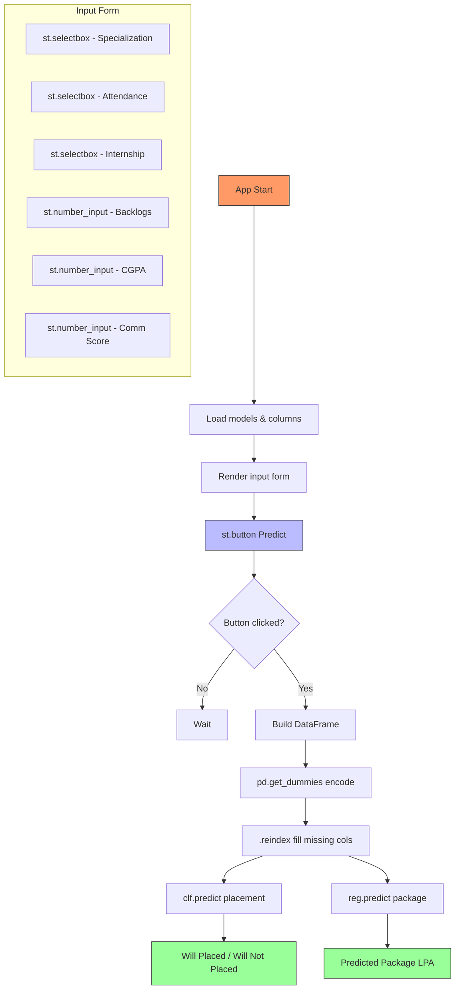

---

## 1️⃣3️⃣ ML Model Training Files

### load_and_save_model.py — Placement Classifier

```python
df = pd.read_csv("student_placement_history.csv")
X = pd.get_dummies(df.drop(columns=["StudentID", "Placed"]))
y = df["Placed"]
model = DecisionTreeClassifier(max_depth=4, random_state=42)
model.fit(X_train, y_train)
joblib.dump(model, "placement_model.pkl")
joblib.dump(list(X.columns), "placement_columns.pkl")
```

| Function/Class | Kaam | Kyu? |
|---|---|---|
| `pandas.read_csv()` | CSV file padhta hai | Data load karne ke liye |
| `pd.get_dummies()` | Categorical columns ko numeric banata hai | ML model numbers samajhta hai |
| `train_test_split()` | Data ko train/test mein baantta hai | Model evaluation ke liye |
| `DecisionTreeClassifier()` | Decision tree model | Placement predict karta hai (Placed/Not Placed) |
| `model.fit()` | Model ko train karta hai | Patterns seekhne ke liye |
| `model.score()` | Accuracy calculate karta hai | Model ko evaluate karne ke liye |
| `joblib.dump()` | Model file mein save karta hai | Baad mein use karne ke liye |

### Flow

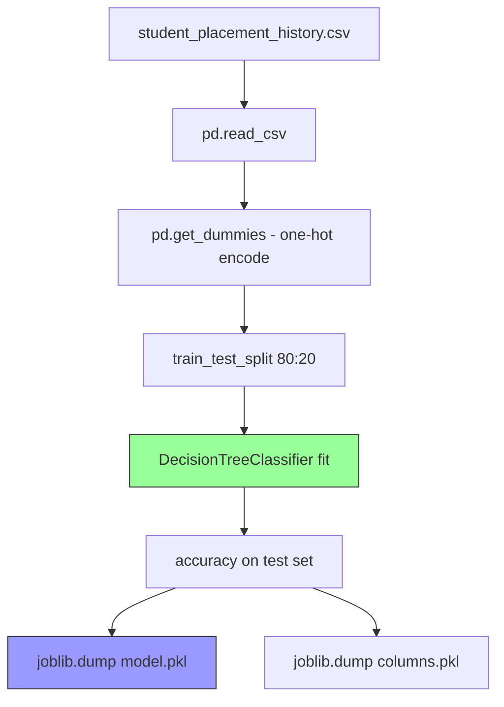

### load_and_save_regressor.py — Package Regressor

```python
df = pd.read_csv("student_package_prediction.csv")
X = pd.get_dummies(df.drop(columns=["StudentID", "PackageLPA"]))
y = df["PackageLPA"]
model = LinearRegression()
model.fit(X_train, y_train)
print("MAE:", mean_absolute_error(y_test, model.predict(X_test)))
joblib.dump(model, "package_model.pkl")
```

| Function/Class | Kaam | Kyu? |
|---|---|---|
| `LinearRegression()` | Linear regression model | Salary package predict karta hai (continuous number) |
| `mean_absolute_error()` | Average prediction error | Model ki accuracy measure karta hai |
| `model.predict()` | Predictions generate karta hai | Naye data ke liye output |

### Flow

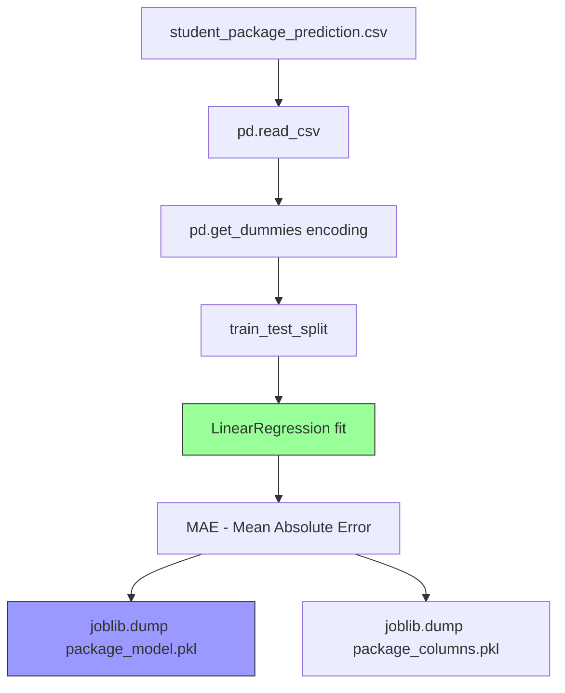

### load_and_confirm.py — Model Verification

```python
clf = joblib.load("placement_model.pkl")
reg = joblib.load("package_model.pkl")
# Rebuild test sets
print("Classifier accuracy:", clf.score(X8_test, y8_test))
print("Regressor MAE:", mean_absolute_error(y9_test, reg.predict(X9_test)))
```

| Function | Kaam | Kyu? |
|---|---|---|
| `joblib.load()` | Saved model file load karta hai | Train kiye hue model ko wapas use karne ke liye |

---

## 🧠 Complete Project Architecture

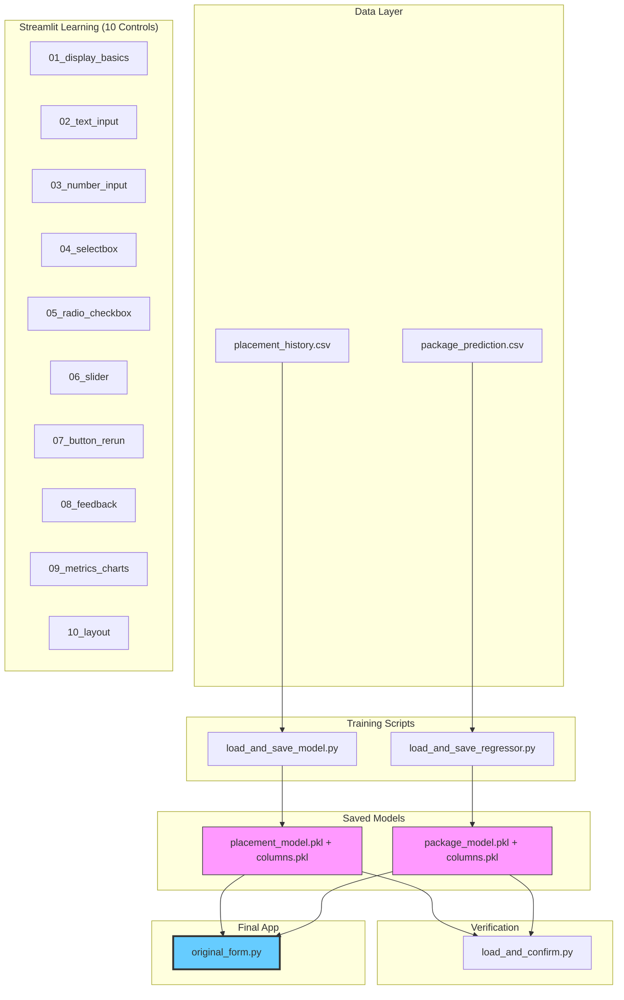

---

## 📦 Requirements

```
streamlit
pandas
scikit-learn
joblib
```

---

## 🚀 Run Commands

```bash
# 🎯 Main App
streamlit run original_form.py

# 📝 Widget demos (10 controls)
streamlit run 01_display_basics.py
streamlit run 02_text_input.py
# ... saare 10 controls individually

# 🤖 Train models (pehle run karo)
python load_and_save_model.py
python load_and_save_regressor.py

# ✅ Verify saved models
python load_and_confirm.py
```

---

## 💡 Quick Reference: Widget Categories

| Category | Widgets | Job |
|---|---|---|
| **Display** | `title`, `header`, `subheader`, `write`, `caption`, `markdown` | Text dikhana |
| **Input** | `text_input`, `number_input`, `text_area` | Data lena |
| **Selection** | `selectbox`, `radio`, `checkbox`, `multiselect`, `slider` | Choice lena |
| **Action** | `button`, `download_button`, `form_submit_button` | Action trigger karna |
| **Feedback** | `success`, `error`, `warning`, `info`, `exception` | Result batana |
| **Layout** | `columns`, `sidebar`, `tabs`, `expander`, `container` | Arrange karna |
| **Chart** | `line_chart`, `bar_chart`, `area_chart`, `scatter_chart`, `pyplot` | Visualize karna |
| **Metric** | `metric` | Single number highlight |

---

> **Built with ❤️ using Streamlit** — Har ek widget ka demo, ML model training, aur deployment-ready code ek saath.
